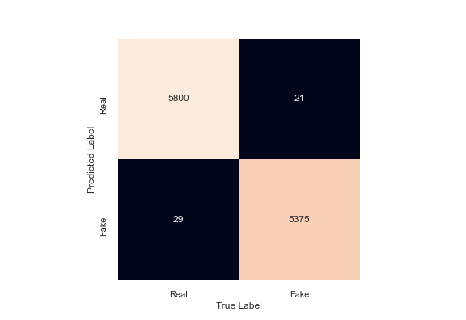
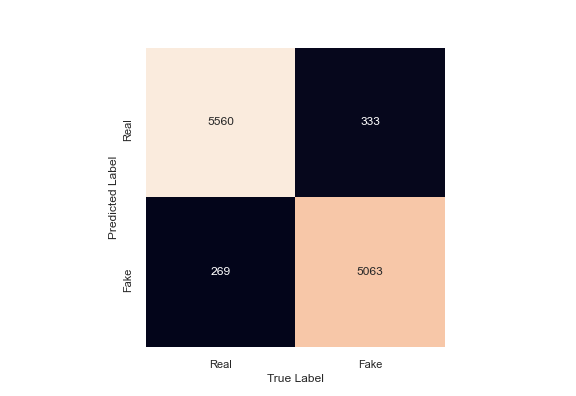
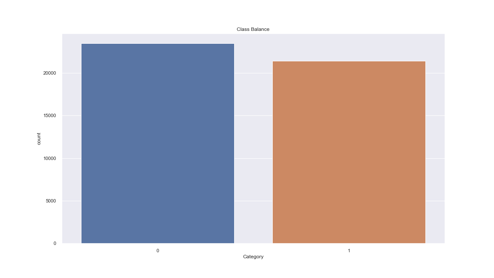

# JJ_NLP

## Introduction:

A type of yellow journalism, fake news encapsulates pieces of news that may be hoaxes and is generally spread through social media and other online media. This is often done to further or impose certain ideas and is often achieved with political agendas. Such news items may contain false and/or exaggerated claims, and may end up being viralized by algorithms, and users may end up in a filter bubble. 
https://data-flair.training/blogs/advanced-python-project-detecting-fake-news/

## Objective:
 
To build a model to accurately classify a piece of news as Real(1) or Fake(0).

## The Dataset:

* Data Flair

## Skills Required to Complete:

The skills used to complete this project consisted of:

* Working with Python to make visualizations using Matplotlib & Seaborn
* Using Pandas to collect and clean the dataset
* Building & interpreting various algorithmic models based on Accuracy/F1 Scores & hyperparameter tuning
* Using different Vectorizers such as Counter Vectorizer & TF-IDF to convert the words into numbers for needed modeling

## What Was Posted on GitHub:

Two separate notebooks were posted on GitHub. One was the Final Project notebook which consisted of the Data Cleaning, Collection, EDA/Data Preprocessing & Modeling components of the project and the ReadMe notebook which is a layout of how the project was presented.

## Questions That Were Posed:

* How does the frequency of particular words impact whether or not it is classified as Real or Fake?
* Does the quantity or types of puncuation in a given article determine whether it is classified as Real or Fake?
* Does the general time frame of when the articles were published make a difference in the classification?

## How the Data Was Put Together:

The data was gathered from about 44,000 different news articles from the Data Flair website. Following that, the data was preprocessed & cleaned in order to put into the various different models. Next, EDA's were performed to visualize the different word frequencies after the data was vectorized & the stop words were set. Finally, the data was run through grid searches & cross validations in order to determine the best model to predict if a news article was fake or not.

## Models:

For this project, two different vectorizing techniques were implemented & tested against each other. The TF-IDF model vectorizes based on the product of the term frequency and the inverse document frequency to highlight words that appear infrequently but may illuminate some meaning in the document. The last model that was used was the Count Vectorizer which provides a simple way to both tokenize a collection of text documents and build a vocabulary of known words, but also to encode new documents using that vocabulary. The TF-IDF model was run through Random Forest, Naive Bayes, and Support Vector Machine(SVM) classifiers while the Count Vectorizer model was only run on the Naive Bayes classifier. Given the dataset’s even distribution of labels we considered 50% accuracy the baseline prediction. While all the models performed fairly well with scores in the high 90’s, I decided on the Random Forest model as our final model with an accuracy score of 0.9955 and an F1 score of 0.9949.

## Future Steps:

* To use the advanced NLP library, spaCy, in order to build an application that processes and “understands” large volumes of text(long news articles).
* Using an RNN Model to more accurately predict news articles being Real or Fake.

## Conclusion:

Through the EDA I found that context was important in regards to extracting the relevance from news articles. Though I would like to apply this model to other types of articles and to attempt stacking models for better performance, this model could give a very good sense whether or not a news article is Real or Fake.

## Presentation Link:

https://docs.google.com/presentation/d/1NIIhjGtGR8bj9cGUHQXqhrsoaIsfJyqAZl-HC5OCrgA/edit#slide=id.p

## Visual:

* Support Vector Machine(SVM): Performed an Accuracy score of 0.9955

* Naive Bayes: Performed an Accuracy Score of 0.9463

* Balance of Dataset:

